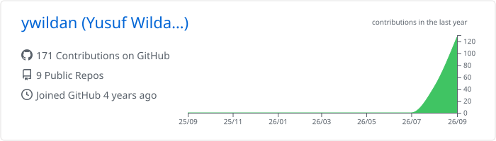

<h1 align="center">Yusuf Wildan Affandi</h1>

  Full-stack engineer focused on thoughtful products, reliable systems, and purposeful automation.

  <a href="https://linkedin.com/in/yusufwildan">LinkedIn</a> ·
  <a href="https://yusufwildan.vercel.app">Portfolio</a> ·
  <a href="https://github.com/ywildan?tab=repositories">Projects</a>

  

---

## About

I turn real operational problems into focused digital products. My process starts with clear product intent and structured specifications, then moves through rapid iteration, automated workflows, and deliberate review.

I care about simple interfaces, maintainable architecture, secure business logic, and documentation that stays useful as a product evolves.

## Featured Project — [Karsa](https://github.com/ywildan/karsa)

**Karsa** is an internal academic platform for Universitas Tidar that replaces fragmented paper and spreadsheet workflows with a centralized system for recording student participation points.

It provides a fast, mobile-first flow for course coordinators, personal reports and class leaderboards for students, and a desktop administration workspace for managing academic data, recaps, and audit history. Access is protected through role-aware routing, server-side authorization, and Google Workspace authentication restricted to the university domain.

The product is developed through a specification-led, automation-driven workflow. Living product requirements, architecture notes, security rules, and operational runbooks evolve alongside the implementation, keeping fast iteration traceable and intentional.

`Next.js` · `TypeScript` · `React` · `PostgreSQL` · `Prisma` · `NextAuth` · `Tailwind CSS` · `Flutter`

## Focus

Product engineering · Full-stack development · API and data modeling · Workflow automation · System architecture

## GitHub Activity

  

## Connect

I'm open to thoughtful collaborations and conversations about building useful software. Reach me on [LinkedIn](https://linkedin.com/in/yusufwildan) or explore my work through the [repositories](https://github.com/ywildan?tab=repositories) on this profile.
